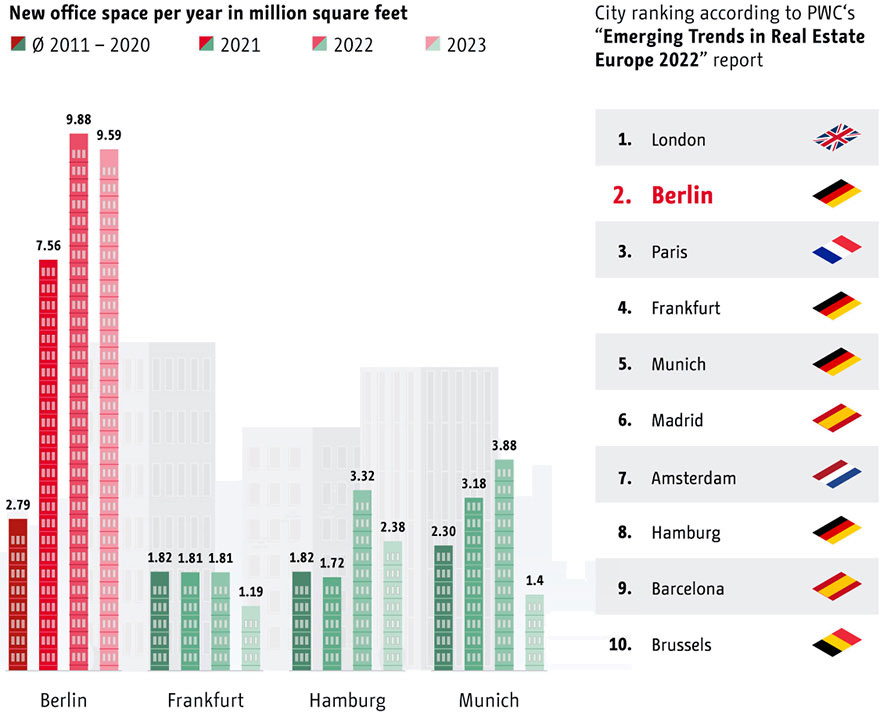
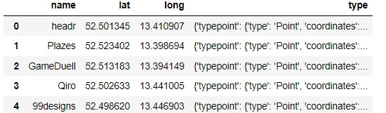
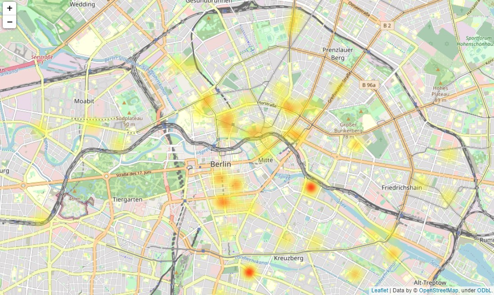
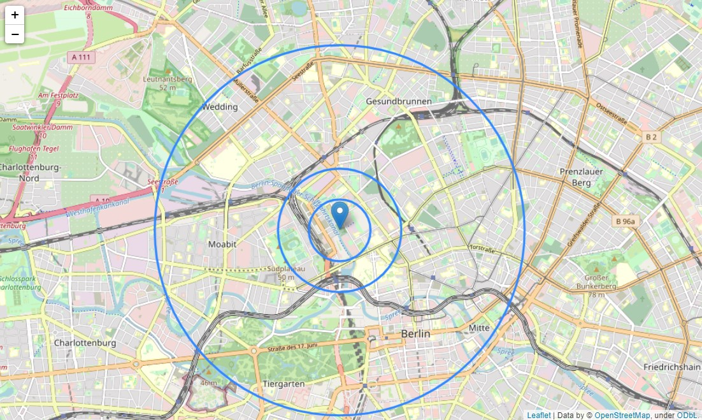
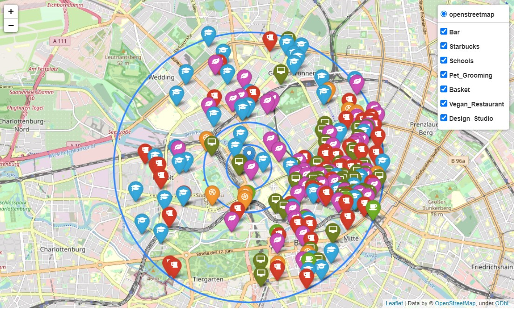
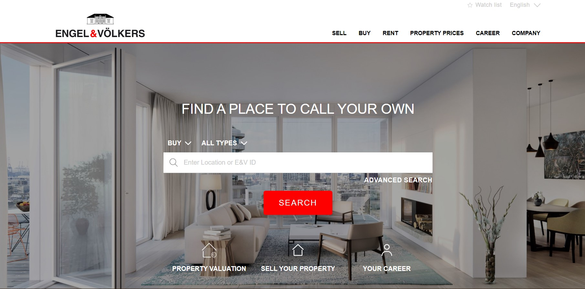
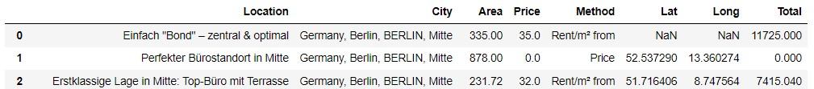
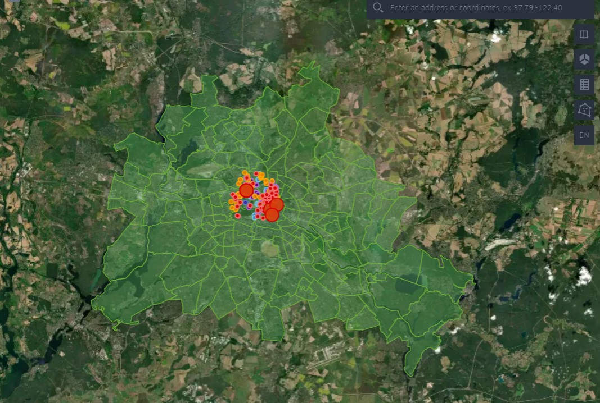
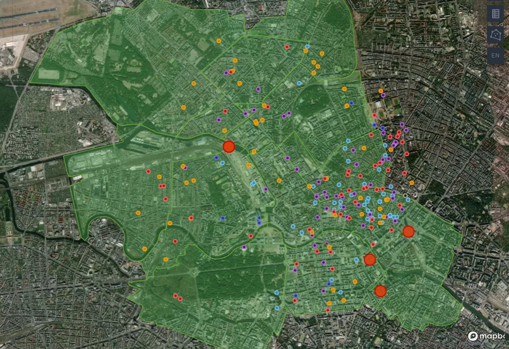
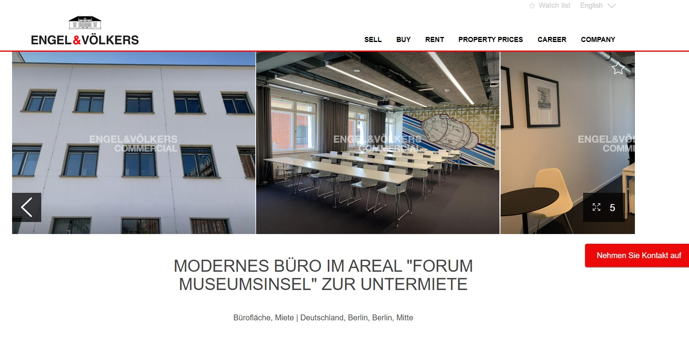

#

# Project III Geospatial
## Choosing BEST location for new Office venue
### By: Edgard Cuadra
### Date: August 1st 2022

#

#
## Initial conditions:
#

The goal is to place the new company offices in the best place for the company to grow. You have to find a place that more or less covers all the following requirements (note that it's impossible to cover all requirements, so you have to prioritize at your glance):

    Designers like to go to design talks and share knowledge., There must be some nearby companies that also do design. 

    30% of the company staff have at least 1 child. 

    Developers like to be near successful tech startups that have raised at least 1 Million dollars. 

    Executives like Starbucks A LOT. Ensure there's a starbucks not too far. 

    Account managers need to travel a lot. 

    Everyone in the company is between 25 and 40, give them some place to go party. 

    The CEO is vegan. 

    If you want to make the maintenance guy happy, a basketball stadium must be around 10 Km. 

    The office dog—"Dobby" needs a hairdresser every month. Ensure there's one not too far away. 

#
## Where to Search?
#

We are infering that the offices are to be set in the city of berling, where according to a PWC report, its ranked as second in new office space per year per square feet. 

Knowing this where do we start?

We have a MongoDB with all the up and comming companies (Startups) this data base contains more than 18,000 companies around the world, using code we can filter all the companies that have offices in the city of "Berlin"

    query = {"offices.city": "Berlin"}
    projection = {"_id":0,"name":1,"offices.city":1, "country_code":1,
                "offices.latitude":1, "offices.longitude":1,"office.city":1}
    list(companies.find(query, projection))[:5]

Even though we have a filtered list, this list displays all the companies that have office in berlin, but it also shows all the information for all there othere offices. given this we need to further filter and only keep the information for the "Berlin" office by using the following code:

    berlin_clean = []
    for i in berlin_company_dirty:
        for j in i['offices']:
            if j['city'] == 'Berlin':
                city = j['city']
                lat = j['latitude']
                lon = j['longitude']
                name = i['name']
                type_ = ({"typepoint": 
                        {"type": "Point", 
                            "coordinates": [j['latitude'], j['longitude']]}})
                
                berlin_clean.append({"name":name, "lat":lat, "long":lon, "type":type_})
    berlin_clean

Now that we have the information we want we can check the coordinates for all the 94 companies we extracted from the database. in this case we have 17 missing coordinates so we will have to drop those since there is no information for us to take decisions. as a result we get a dataframe of 77 startups in the area of Berlin . 

Sample: 

Using the folium library we proceed to display the coordinates of the startups into a heat map. this will allow us to see where there is the highest concentration on startups in the city of "Berlin"

As we can see in the image above, there is a high concentration on a neighborhood group called **Mitte**

we pulled the geolocation from google gettin: 

    mitte_lat = 52.53211713308012 
    mitte_long = 13.370612229900534

Lets mark this coordinates as our stating point of our marker, and search all the venues that our coworkers wish to have in proximity to our new company location. we will place a radius marker at 500mts, 1000mts and 3000mts. this markers are to show the distance there is between venues.

#
## What is near our location?
#

Using the Mitte coordinates we do an API query to www.foursquare.com/

using the formula bellow, this query will extract info of all the businesses that fall under the query criteria. nontheless, we only want the name of the business and its location so we use the following code to get the desired information.

Function:

    def query4sqr (query, location, radius):

        if " " in query.strip():
            query_ok = query.strip().replace(" ","%20")
        else:
            query_ok = query
        url = f"https://api.foursquare.com/v3/places/search?query={query_ok}&ll={str(location[0]).strip()}%2C{str(location[1]).strip()}&radius={radius}&limit=50"
        headers =  {
        "Accept": "application/json",
        "Authorization": f"{client_key}" # tengo que validar si poner la llave en la funcion es factible.
        }
        response = requests.get(url, headers=headers)
        
        if response:
            response=response.json()['results']
            new_list = [ {"name" : i["name"],
                        "lat"  : i["geocodes"]["main"]["latitude"],
                        "long" : i["geocodes"]["main"]["longitude"],
                        "type" : {"typepoint":
                                    {"type": "Point",
                                    "coordinates": [lat, lon]}}} for i in response]
        return new_list

Once we have the dataframe of each query we use the following code to add a marker color, symbol and tooltip. so that we can identify them in the map using their coordinates.

Example:

    bar_group = folium.FeatureGroup(name="Bar")

    for index, row in df_bar.iterrows():
        
        venue = {"location": [row["lat"], row["long"]], "tooltip": row["name"]}
        
        icon = Icon (
                color="red",
                prefix="fa",
                icon="beer",
                icon_color = "white")
        
        bar_group.add_child(Marker(**venue, icon=icon))
        mitte_map.add_child(bar_group)

now that we have all this se we display it into a map that has a layer control so we can remove those groups of markers that we are not interested in viewing.

All venues near our location in a 3 km radius:

#
## Office building listings:
#

In order to be able to select a new office space we need to make sure there is availability of offices in the area of Mitte, Berlin. so we **scrapped the web page** of Engle&Volkers https://www.engelvoelkers.com/en/ for all the listings in Mitte, Berlin, Germany:

This web page has no reference to their geo location so we need to use the written address to be able to know their location, locally the google map page can allow us to get GPS coordinates with address. so we created a function to be used as a GoogleAPI query to get those coordinates:

    def get_latlng(address_or_zip):
        lat, lng = None, None
        api_key = google_client_key
        base_url = "https://maps.googleapis.com/maps/api/geocode/json"
        endpoint = f"{base_url}?address={address_or_zip}&key={api_key}"
        r = requests.get(endpoint)
        if r.status_code not in range(200, 299):
            return r.status_code
        try:
            '''
            This try block incase any of our inputs are invalid. 
            This is done instead of actually writing out handlers 
            for all kinds of responses.
            '''
            r.json()
            results = r.json()['results'][0]
            lat = results['geometry']['location']['lat']
            lng = results['geometry']['location']['lng']
        except:
            pass
        return lat,lng

The output is a dataframe with the main listings near the area that we are interested in finding an office building:

Now we can use a Geojson polygon map to display the neighborhoods in Berlin and start merging all our information together:

This final map integrates: Markers, Geo-polygons, Listings and prices. we can see all the venues of interest to our colegues and the red makers that are bigger than the rest is the location of our listings, with this information we can now proceed to make a decision.

#
## Conclusion and Recomendations:
#

The following listing complies with most of the criterias with the exception to the Airpot and Basketball Satadium.

**Airport**:we couldnt comply with all the requirements that some employees have if we where to have proximity to the airport the number of other venues would decrease proportionaly to the inverse of the distance.

**Stadium**: the closest stadium is the "Mercedez Benz Arena" which is 20km away, if we where closer to the Stadium we would have to be 10 km away from startup locations.

Given the results of the search we sugest that the best option of listings is the following one:

**Listing**:

https://www.engelvoelkers.com/en-de/property/modernes-buero-im-areal-forum-museumsinsel-zur-untermiete-4175510830.689917825_exp/

Location = Modernes Büro im Areal "Forum Museumsinsel" zu. 
City = Mitten, Berlin, Germany  
Latitude = 52.516933 
Longitud = 13.401900 
Listing Price = EU 16,695.00 

